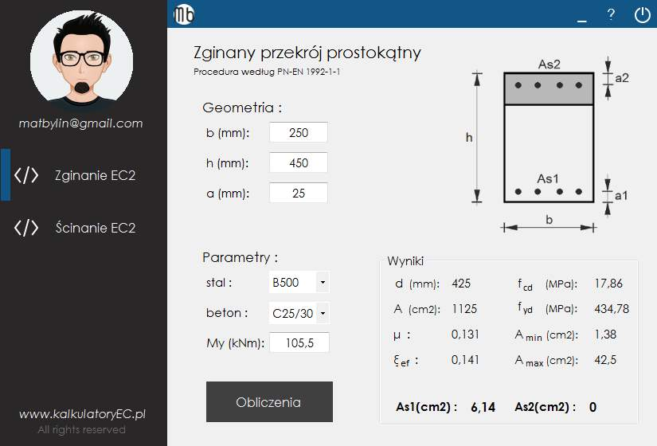

# Fello concrete
Structural engineer calculations for rectangular concrete beams. The application has two modules: shear and bending. Calculations are in accordance with the PN-EN-1992-1-1 european norm. FelloConcrete was written in C#.

## Build With
* [Visual Studio](https://visualstudio.microsoft.com/) - IDE used for this project.

## License
This project is licensed under the GNU General Public License v3.0 - see the [LICENSE.md](LICENSE.md) file for details.

## Credits
* Face avatar from [face.co](https://face.co/)
* App icons from [icons8.com](https://icons8.com/)

## Author
* Mateusz Byliński 

## Contact
- `matbylin@gmail.com`
